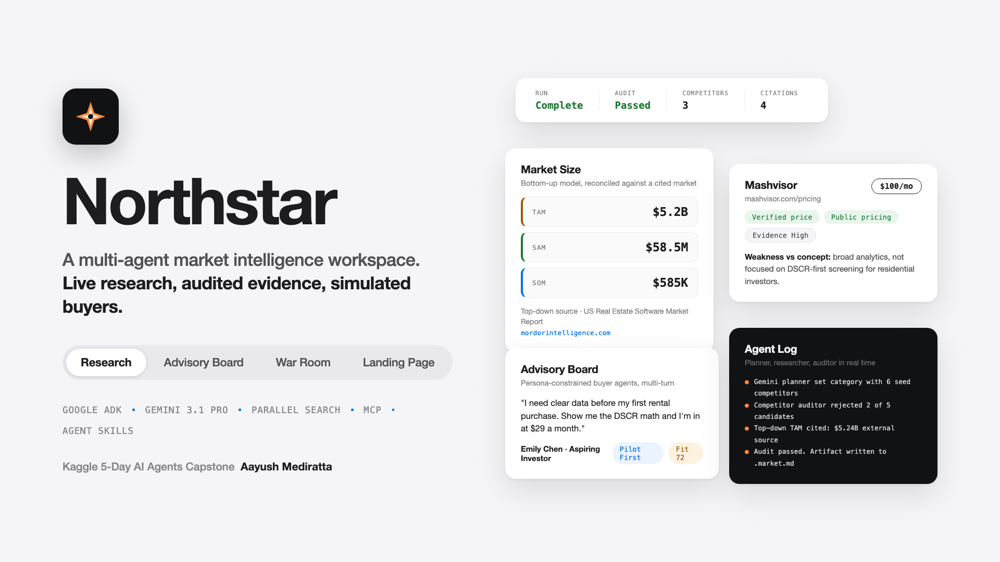
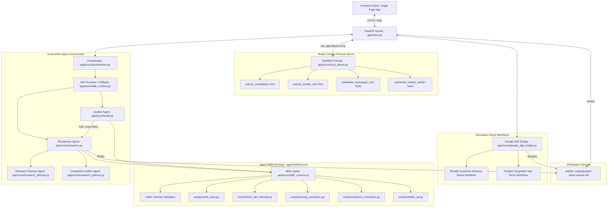

# 🧭 Northstar: Market Intelligence Workspace



Northstar is a production-grade market intelligence workspace built for startup concepts. Running inside a single Docker Compose stack, it implements a multi-agent validation pipeline to perform live web research, audit competitive signals, estimate TAM/SAM/SOM, and run interactive persona-constrained simulations.

This project was built for the **Kaggle 5-Day AI Agents Intensive Course** Capstone Project.

🌐 **Live Demo Endpoint:** [https://aayush.foo](https://aayush.foo)

---

## 🏗️ Architecture Overview

Northstar uses a layered multi-agent design. The system runs an orchestrator that coordinates research planning, live search parsing, competitive auditing (with feedback loops), and simulated buyer/competitor dynamics using the Google ADK.



---

### 🏛️ Architectural Decision: Pragmatic Monolith over Microservices
For this capstone workspace, a structured monolithic architecture was selected intentionally over a microservice-based design. This decision is motivated by three main constraints:
1. **Latency Overhead Minimization:** Competitive searches, page scraping, and multi-agent loops already incur high latency from external LLM API calls. Introducing network latency, serialization overhead, and connection management between microservices would degrade performance.
2. **Operational Simplicity:** A single Docker container (or a single Python process running locally) removes the operational complexity of service orchestration, network routing, and multi-service health monitoring, allowing developers or graders to spin up the entire stack instantly.
3. **Data Lifecycle Consistency:** Keeping state inside memory and serializing directly to the single `.market.md` file guarantees atomic transitions across the Research, Advisory Board, and War Room modes without needing a distributed transactional database.

---

## 🎯 Applied Course Concepts

Northstar implements **5 out of the 6** key concepts from the Kaggle 5-Day Intensive Course:

### 1. Agent & Multi-Agent Systems (ADK)
* **Double-Agent Loop:** Orchestrates a structured `ResearcherAgent` and `AuditorAgent` team inside an execution loop. If the auditor flags structural or URL validation failures, the draft is returned to the researcher for corrective revision.
* **Dynamic Simulation Graphs:** Uses the Google ADK (`google-adk`) to dynamically construct agent graphs at runtime. When simulating the *Advisory Board* or *War Room*, it parses the `.market.md` blueprints, instantiates parallel buyer/competitor agents (utilizing `google.adk.Agent` and `Runner` with persistent `InMemorySessionService` history), and compiles their output using an ADK synthesizer agent.

### 2. Model Context Protocol (MCP)
* **Local FastMCP Server:** A fully featured `FastMCP` server is mounted directly into the FastAPI stack under `/mcp` via SSE. 
* **Workspace & Search Tools:** Exposes 6 distinct tools (`search_competitors`, `search_market_size`, `read_workspace_text`, `write_workspace_text`, `read_market_artifact`, and `write_market_artifact`) alongside 2 resources (`workspace://output` and `workspace://artifact/{filename}`) enabling external LLMs or agents to inspect and modify artifacts.
* **In-Loop Tool Use:** The `ResearcherAgent` now uses the hosted Parallel Search MCP (`https://search.parallel.ai/mcp`) during normal execution for competitor discovery and page fetches. Northstar also routes artifact read/write and top-down market-size lookups through its local MCP tool layer when reachable, with direct fallbacks retained when MCP is unavailable.

### 3. Agent Skills (Procedural Memory)
* **Runtime-Active Package:** Built as a standard agent skills package under [.agent/skills/scout/](.agent/skills/scout/). Instead of acting as passive documentation, these assets are loaded dynamically at runtime via `skill_runtime.py`.
* **Execution Guardrails:** Standardizes URL checks, evidence string ranking, pricing normalization, and schema checks through [market_schema.yaml](.agent/skills/scout/schemas/market_schema.yaml) and executable python scripts.

### 4. Security Features
* **Path Sandboxing:** The MCP workspace utilities restrict filesystem actions using `_resolve_workspace_path` validation, preventing path-traversal attacks outside the project directory.
* **Inbound Bounding & Rate Limiting:** Enforces a strict request body size limit of **5MB** via `RequestSizeLimitMiddleware` and implements rolling IP-based rate limiting via `RateLimitMiddleware` to prevent DoS and API abuse on high-cost routes.
* **Strict Validation:** Uses strict Pydantic model schemas for all REST API entry points, protecting backend inputs, and isolates API credentials entirely within `.env`.

### 5. Deployability & Reproducibility
* **Docker Environment:** The entire application is containerized using a slim [Dockerfile](Dockerfile) and [docker-compose.yml](docker-compose.yml) setup to ensure instant, local replication.
* **Service Watchdog:** Includes a [restart.sh](restart.sh) launcher that manages container life-cycles, starts dependencies (like Colima on macOS), and performs health-check polls before serving.

---

## 🛠️ Stack & Dependencies

* **Language:** Python 3.11+
* **Backend Framework:** FastAPI / Uvicorn
* **Agent Engine:** Google GenAI SDK & `google-adk`
* **MCP Integration:** `mcp` FastMCP Server
* **Frontend:** Vanilla HTML5 / ES6 Javascript SPA utilizing custom CSS properties and responsive Flexbox layouts.
* **PDF Engine:** ReportLab-driven programmatic PDF converter.

---

## 📦 Directory Structure

```text
├── .agent/
│   └── skills/
│       └── scout/                  # Reusable Skill Package
│           ├── schemas/            # Validation schemas (YAML)
│           ├── scripts/            # Normalizers, verifiers & QA helpers
│           └── SKILL.md            # Skill procedural runbook
├── app/
│   ├── scout/                      # Main Agent Engine
│   │   ├── adk_runtime.py          # Execution runtime definitions
│   │   ├── agents.py               # Adapter agents
│   │   ├── audit.py                # Auditor wrapper
│   │   ├── competitor_names.py     # Competitor name utility
│   │   ├── google_adk_bridge.py    # Google ADK graph manager
│   │   ├── orchestrator.py         # Main loop orchestrator
│   │   ├── parallel_search.py      # Parallel search utilities
│   │   ├── render.py               # Markdown generation engine
│   │   ├── research.py             # Researcher implementation
│   │   ├── research_planner.py     # Planner & validation prompting
│   │   ├── skill_runtime.py        # Skill runtime package loader
│   │   ├── simulators.py           # Fallback simulator rules
│   │   ├── tam.py                  # TAM calculations
│   │   ├── verify.py               # Validation checks
│   │   └── web.py                  # Web scraping routines
│   ├── config.py                   # Environment configuration loader
│   └── main.py                     # FastAPI routes & server lifecycle
├── frontend/                       # Client SPA
│   ├── app.js                      # Application state & rendering logic
│   └── index.html                  # Core application structure
├── output/                         # Target location for generated market documents
├── tests/                          # Automated PyTest flows
│   └── test_northstar_flows.py     # Integration test suite
├── Dockerfile                      # Application container build script
├── docker-compose.yml              # Multi-container stack setup
├── restart.sh                      # Shell bootstrap utility
└── requirements.txt                # Pinned python packages
```

---

## 🚀 Quick Start

### 1. Prerequisites
Ensure you have Docker and Docker Compose installed.

### 2. Run the Bootstrap Script (Recommended)
Simply execute the interactive launch script. It automatically detects missing configuration, prompts you for your API keys in the terminal, sets up your `.env` file, spins up the Docker containers, and runs the health watchdog:
```bash
bash restart.sh
```

### 3. Manual Configuration (Alternative)
If you prefer to configure the environment manually or run the containers directly:

1. Copy the environment template:
   ```bash
   cp .env.example .env
   ```
2. Open `.env` and fill in your keys:
   - **`GOOGLE_API_KEY`**: Obtain a key for free/pay-as-you-go from [Google AI Studio](https://aistudio.google.com/).
   - **`PARALLEL_API_KEY`** *(Optional)*: Obtain a search key from [Parallel Search](https://parallel.so/) to enable live web competitive analysis.
3. Spin up the containers manually:
   ```bash
   docker compose up --build -d
   ```

### 4. Access the Workspace
Once the startup script or docker containers are running, access the interfaces at:
* **Client App:** [http://127.0.0.1:8000](http://127.0.0.1:8000)
* **Health Check:** [http://127.0.0.1:8000/health](http://127.0.0.1:8000/health)

---

## 🧪 Running Tests

The workspace includes a complete test suite verifying name sanitization, skill execution, audit-retries, simulation states, and PDF rendering. Run them locally or within the environment:

```bash
python -m unittest tests.test_northstar_flows
```

---

## 🐍 Running Locally (Without Docker)

If you prefer to run the workspace directly on your host machine without Docker:

### 1. Create and Activate Virtual Environment
```bash
python3 -m venv .venv
source .venv/bin/activate
```

### 2. Install Python Dependencies
```bash
pip install --upgrade pip
pip install -r requirements.txt
```

### 3. Start the FastAPI Development Server
```bash
uvicorn app.main:app --host 127.0.0.1 --port 8000 --reload
```

Once running:
- Open the UI at: **[http://127.0.0.1:8000](http://127.0.0.1:8000)**
- Verify health status at: **[http://127.0.0.1:8000/health](http://127.0.0.1:8000/health)**

## 🛡️ Security Model

Northstar enforces several production-grade security postures designed to prevent abuse and protect host resources:

### 1. Inbound Request Bounding & Rate Limiting
- **Request Size Limiting:** A strict request body size limit is enforced at **5MB** via `RequestSizeLimitMiddleware` to prevent denial-of-service (DoS) attacks via oversized payloads.
- **Endpoint Rate Limiting:** Rate limits are enforced on high-cost routes (such as `/api/run`, advisory board/war room simulations, and PDF exports) on a per-IP basis using a rolling window middleware.

### 2. Path Traversal & Sandbox Protection
- **Workspace Sandboxing:** The filesystem MCP tool resolves all paths against the workspace root, explicitly blocking path-traversal attacks (e.g., `../..`) by validating target paths stay within approved directories.
- **Container Sandboxing:** The app runs inside Docker, isolating file access and ambient authority from the host machine.

---

## 📄 License

This project is licensed under the **Creative Commons Attribution-NonCommercial-ShareAlike 4.0 International (CC BY-NC-SA 4.0)** license. See the [LICENSE](LICENSE) file for the full legal text. Non-commercial redistribution and modifications are welcomed with attribution.
