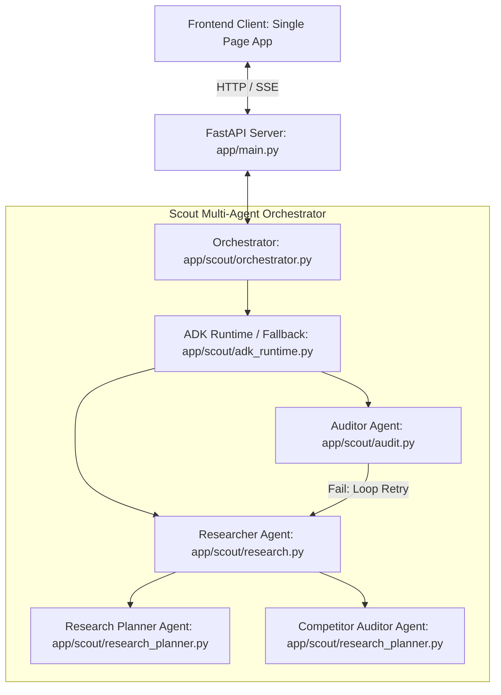

# Architecture

Northstar is structured as a multi-agent system. Below is a detailed view of the orchestration, planning, and execution components.

## 🏗️ System Architecture Flowchart

## 🛠️ Multi-Agent Double-Loop Orchestration

1.  **Research Planner Agent:** Analyzes the startup concept and constructs the initial search strategies, seeding competitor list names and planning geographic scope.
2.  **Researcher Agent:** Coordinates live web lookups via Parallel Search and scrapes structured data.
3.  **Competitor Auditor Agent:** Filters non-competitors, parses feature matches, and identifies weaknesses.
4.  **TAM/SAM/SOM Sizing Engine:** Executes algorithmic Bottom-Up pricing math and validates against top-down industry reports.
5.  **Auditor Agent:** Adversarially checks results for path, URL, and schema validation. If checks fail, it triggers a retry loop returning recommendations back to the Researcher.

## 👥 Dynamic Antigravity ADK Simulations

When performing Customer Advisory Board pitches or War Room incumbent threat simulations:
*   The system dynamically parses the generated `.market.md` file.
*   Instantiates parallel instances of custom buyer/competitor agents using the Google ADK framework.
*   Persists conversation history via `InMemorySessionService` for multi-turn validation.
